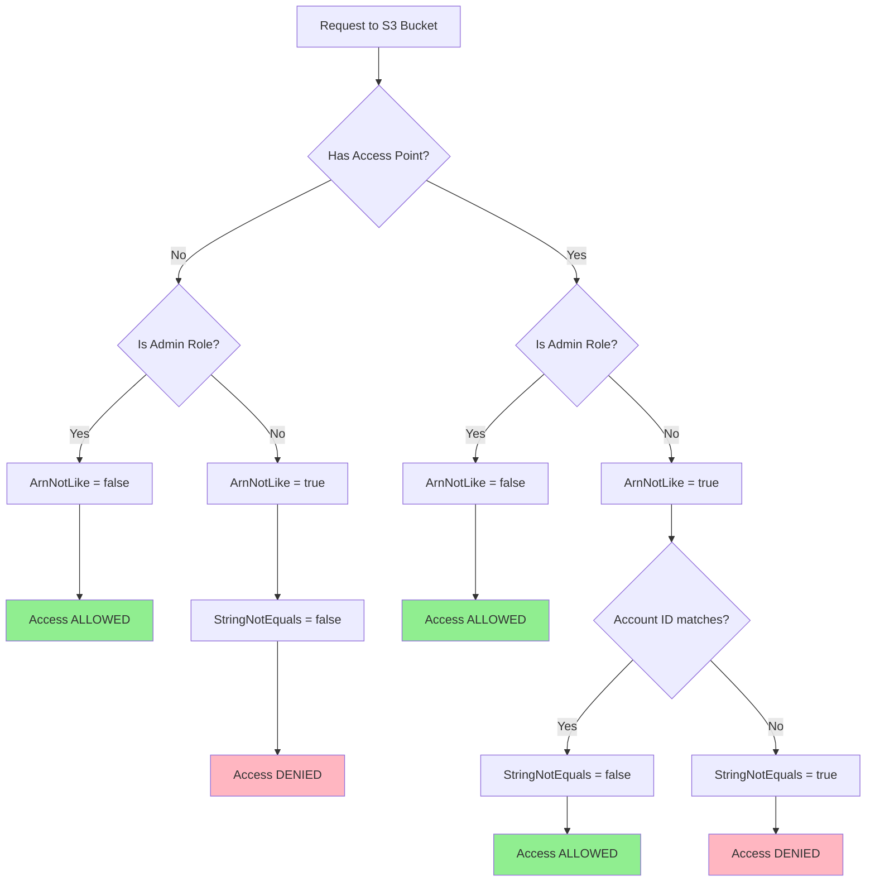

# Goal: Not touching bucket policy of shared bucket

One of the most significant advantages of using S3 Access Points is the ability to grant specific access to parts of a bucket **without altering the main bucket policy**. This is especially beneficial when:

*   **Sharing a bucket:** Modifying a central bucket policy can be risky and complex, potentially impacting numerous users or applications. Access Points provide isolated access controls.
*   **Delegating access management:** Different teams can manage their own Access Point policies without needing permissions to change the bucket policy.
*   **Bucket policy size limits:** Bucket policies have a 20KB size limit. Access Points help scale access control by distributing policy logic.
*   **Distinct network controls:** You can restrict Access Points to specific VPCs, enabling private network paths to data without changing the bucket policy.

By using Access Points, the bucket policy can remain simpler, focusing on broad rules, while granular permissions are handled by individual Access Point policies. This simplifies management and reduces the risk associated with policy changes.

https://aws.amazon.com/blogs/security/how-to-restrict-amazon-s3-bucket-access-to-a-specific-iam-role/

## Access Point Policy Approach

This implementation uses a **deny-based policy** with `StringNotEquals` for precise role matching:

### Policy Structure (5 statements)

1. **Deny all except allowed role** - Uses `StringNotEquals` to block all principals except the specific role ARN
2. **Deny write operations** - Blocks PutObject, DeleteObject, etc. for the allowed role (read-only access)
3. **Deny ListBucket outside prefix** - Uses `StringNotLike` with `s3:prefix` condition to restrict listing to `s3accesslogs/`
4. **Deny GetObject outside prefix** - Uses `NotResource` to block object access outside `s3accesslogs/`

### StringNotEquals vs StringNotLike

- **StringNotEquals**: Exact match, no wildcards. Used when you have specific role ARNs.
- **StringNotLike**: Pattern matching with `*` wildcards. Used when matching multiple roles via patterns.

For assumed roles, `aws:PrincipalArn` evaluates to the role ARN (e.g., `arn:aws:iam::123456789:role/my-role`), not the session ARN, so both work correctly.

This implementation uses `StringNotEquals` for the first statement (blocking non-allowed roles) since we're specifying exact role ARNs without wildcards. This provides precise, unambiguous access control.

## AWS CLI Usage Examples

### 1. Get the Access Point Alias

```bash
# Get the alias from S3 Control API
AP_ALIAS=$(aws s3control get-access-point \
  --account-id $(aws sts get-caller-identity --query Account --output text) \
  --name s3-check-role-2025-ap \
  --query Alias --output text)
echo $AP_ALIAS
# Output: s3-check-role-2025-a-qhfkiis7tjte69sfoj59rz6545geqeuw2b-s3alias

# Alternative: Get from SSM Parameter Store
AP_ALIAS=$(aws ssm get-parameter --name /s3-access-point/s3-check-role-2025/alias --query Parameter.Value --output text)

# Alternative: Using Terraform output
AP_ALIAS=$(terraform output -raw secure_bucket_access_point_alias)
```

### 2. Assume the Role

```bash
# Export credentials for the allowed role
make export-creds

# Set the credentials file
export AWS_SHARED_CREDENTIALS_FILE=$PWD/aptest-test-consume-credentials
```

### 3. Access Patterns

#### ❌ Listing top-level objects (blocked)

```bash
# Try to list the entire access point - DENIED
aws s3 ls s3://$AP_ALIAS/
# Error: An error occurred (AccessDenied) when calling the ListObjectsV2 operation

# Try to list bar/ prefix - DENIED
aws s3 ls s3://$AP_ALIAS/bar/
# Error: An error occurred (AccessDenied) when calling the ListObjectsV2 operation
```

#### ✅ Listing allowed prefix (permitted)

```bash
# List objects in s3accesslogs/ prefix - ALLOWED
aws s3 ls s3://$AP_ALIAS/s3accesslogs/
# Output: 2025-10-06 19:05:23          45 test.txt

# Get object from s3accesslogs/ prefix - ALLOWED
aws s3 cp s3://$AP_ALIAS/s3accesslogs/test.txt -
# Output: This is a test file in s3accesslogs prefix - 2025-10-06
```

#### ❌ Write operations (blocked)

```bash
# Try to write to allowed prefix - DENIED
echo "test" | aws s3 cp - s3://$AP_ALIAS/s3accesslogs/new.txt
# Error: An error occurred (AccessDenied) when calling the PutObject operation
```

### 4. Direct Bucket Access (blocked)

Even with the role, direct bucket access is blocked by the bucket policy:

```bash
# Try to access bucket directly - DENIED
aws s3 ls s3://s3-check-role-2025/
# Error: An error occurred (AccessDenied) when calling the ListObjectsV2 operation

# Access must go through the access point
aws s3 ls s3://$AP_ALIAS/s3accesslogs/
# Success!
```

# Policy Decision Tree

The following diagram shows how the bucket policy evaluates requests with and without Access Points:



The policy creates three paths to access:
1. Admin roles (always allowed)
2. Access point with matching account ID (allowed)
3. Everything else (denied)

This ensures that:
- Admin roles maintain access regardless of access point usage
- Non-admin roles must use an access point with matching account ID
- All other access attempts are denied